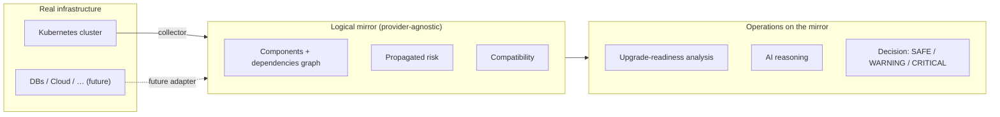
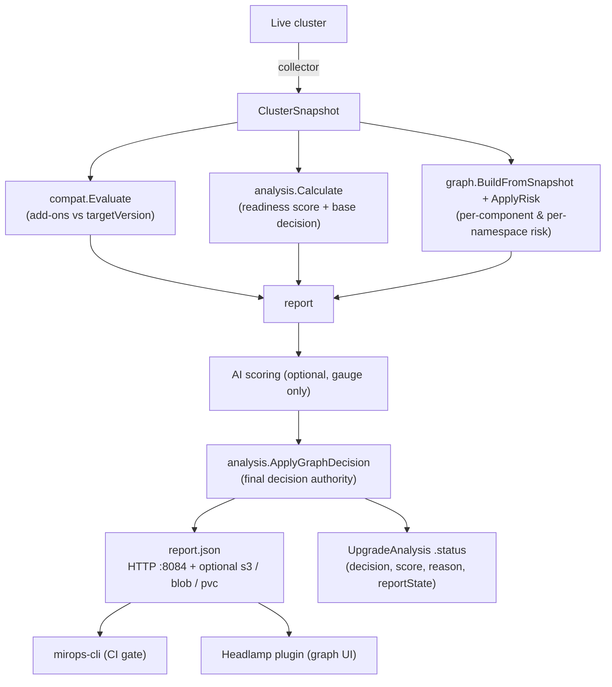
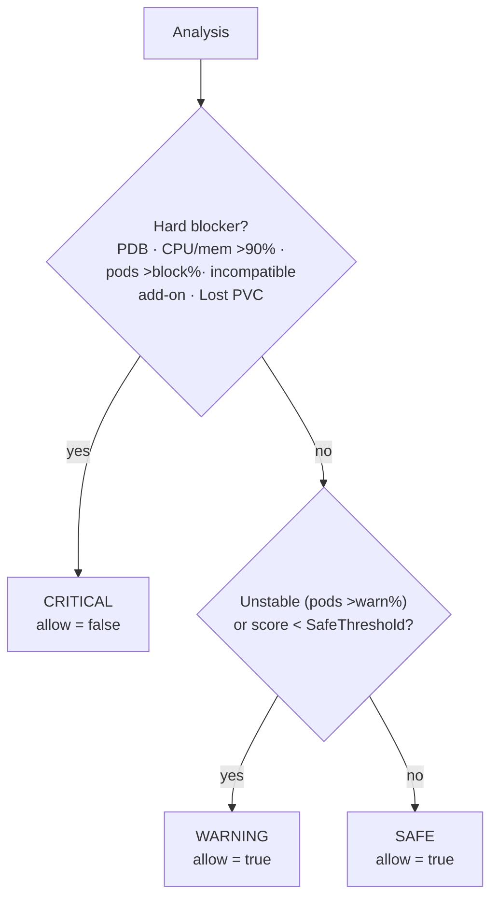

 # mirops — Mirror Operations

[](LICENSE)

> **mirops = mirror-operations.** Build a **logical mirror** of your infrastructure, then run
> operations on the mirror instead of the live system: assess risk, reason about dependencies,
> and decide before you act.

**mirops is open source (Apache-2.0).** This repository is the **Kubernetes operator** — the first
implementation of the mirror-operations concept. It builds a logical mirror of a Kubernetes cluster
(a component graph + dependency risk + add-on compatibility) and uses it to evaluate **how ready the
cluster is for a version upgrade**, optionally letting an AI reason over the mirror. The output is a
`report.json` and a decision: `SAFE`, `WARNING`, or `CRITICAL`.

---

## The concept

A *mirror* is a reduced, structured model of real infrastructure; *operations* are the analyses you
run on that model. The idea is provider-agnostic — Kubernetes is the first provider, but the same
mirror could later model databases, cloud resources, or anything with components and dependencies.



The mirror engine (`internal/graph`) is intentionally **infra-agnostic** — only the Kubernetes
*adapter* (`build.go`) knows about k8s. A new provider adds its own adapter; the rest is reused.

---

## What this operator does



- **Logical mirror**: every workload/service/node/PVC/add-on becomes a node; dependencies become
  edges; risk propagates along them — an add-on incompatible with the target version raises the risk
  of everything that depends on it.
- **Condition-driven decision**: the readiness score is a *gauge*; `CRITICAL` comes only from
  **deterministic facts** — an incompatible add-on, a Lost PVC, a blocking PodDisruptionBudget,
  CPU/memory exhaustion, or pods-not-ready beyond a profile threshold. Every reason is listed in
  `decision.blockers`.
- **AI is a copilot, not the pilot**: when enabled it reasons over a digest of the mirror and nudges
  the gauge (`SAFE ↔ WARNING`) — it can never block or unblock; the facts govern the gate.

---

## The mirops ecosystem

The operator produces `report.json`; these open-source tools consume it. Each lives in its own repo.

| Tool | Repository | Role |
|------|------------|------|
| **Operator** (this repo) | [github.com/miropshq/mirops](https://github.com/miropshq/mirops) | Builds the mirror, scores, decides, serves `report.json`. |
| **CLI** | [github.com/miropshq/mirops-cli](https://github.com/miropshq/mirops-cli) | `mirops scan --source … --enforce` — renders the report and **gates a CI/CD pipeline**. |
| **Headlamp plugin** | [github.com/miropshq/mirops-ui](https://github.com/miropshq/mirops-ui) | Visualizes the dependency graph, decision, add-on compatibility, and per-namespace risk. |
| **Helm charts** | [github.com/miropshq/helm-charts](https://github.com/miropshq/helm-charts) (`mirops-operator/`) | Deploys the operator + RBAC + reports service. |

---

## The mirror engine

The engine (`internal/graph`) turns the snapshot into a **directed dependency graph** and propagates
risk along its edges. Every component gets an intrinsic **base risk**; a dependent then inherits a
**decayed** share of the highest risk it depends on — so a broken foundation raises the risk of
everything built on it.

**Base risk** (before propagation):

| Component | Condition | Base risk |
|-----------|-----------|-----------|
| Add-on | incompatible with target | **90** |
| Add-on | unknown compatibility | 40 |
| Workload | Down / Failed | 70 |
| Workload | Degraded | 40 |
| Workload | Scaled to zero | 10 |
| Infra (node) | NotReady | 60 |
| Storage (PVC) | Lost | **90** |
| Storage (PVC) | Pending | 50 |
| Network / config | — | 0 (inherit only) |

Standalone **pods** with no owning workload (a raw `kubectl run` / Pod manifest) are mirrored too, as
workload-typed nodes: a not-ready bare pod scores like a Down workload (**70**), so a failing pod that
no Deployment covers still surfaces in the graph and its namespace risk.

**Propagation**: a dependent inherits `risk × 0.6` (the decay) of what it depends on, taking the
**highest** path — so a workload behind an incompatible add-on (90) inherits `90 × 0.6 = 54`. A
component with risk **≥ 50** is flagged **at risk**. Risk is then aggregated **per namespace**
(highest component risk, component count, at-risk count) and surfaced as `risk.byNamespace`.

Propagated risk is **informational** — it colors the graph and feeds the decision only when it stems
from a deterministic blocker (an incompatible add-on or a Lost PVC). Diffuse risk never blocks on its
own; it tells you *where* to look.

---

## The readiness score

The score is a **0–100 gauge** of overall cluster health — a thermometer, **not** the gate (see
[the decision model](#the-decision-model)). It is the sum of four dimensions, each starting at its
budget and subtracting penalties:

| Dimension | Budget | Measures |
|-----------|:------:|----------|
| **Health** | 25 | how many pods are broken *right now* |
| **Capacity** | 30 | CPU / memory headroom for rescheduling during the drain |
| **Stability** | 20 | churn and crash-loops over time |
| **Compatibility** | 25 | deprecated APIs and incompatible add-ons |
| **Total** | **100** | |

### Health (25) — proportional

```
Health = 25 − (notReady/total × 15) − (restarting/total × 10)
```

Both terms are **ratios**, so Health scales with cluster size (one bad pod out of 1000 is
negligible; out of 6 it matters) and can never overshoot its budget. A single critical pod that these
ratios dilute is caught instead by the graph's per-component risk and the decision guard.

### Capacity (30) — shared budget

```
Capacity = 30 − (cpuPressure × 15) − (memPressure × 15)
```

CPU and memory **share** the 30 points (15 each), so a cluster at 50% on both is healthy and scores
well — the combined penalty can't exceed 30. `pressure = requests / allocatable` (what pods
*reserve*, which is what the scheduler uses to place rescheduled pods during a node drain). Pressure
**> 90%** on either **blocks the upgrade** (`CRITICAL`, see below) — but that block is a **verdict**
decision, not a score override: the number keeps reflecting the pressure proportionally, as a gauge.

### Stability (20) — partitioned with caps

```
Stability = 20 − crash(≤10) − restartDelta(≤6) − podDrop(≤4)
```

Three signals **partition** the 20-point budget, each **capped** at its slice so no single one can
overshoot:

| Signal | Slice | Meaning |
|--------|:-----:|---------|
| **crash-loops** | 10 | fraction of pods crash-looping now (rate ≥ 10/24h) — the strongest signal |
| **restart trend** | 6 | new restarts since the last run |
| **pod drop** | 4 | fraction of pods lost since the last run (only drops count — scaling up is healthy activity, not instability → smallest slice) |

Because the caps sum to 20, the combined penalty can never exceed the budget (Stability bottoms at 0,
not negative), and the first run — which has no baseline — is bounded instead of tanking the score.

### Compatibility (25) — diminishing

```
Compatibility = 25 − 25 × (1 − 0.6^(deprecatedApis + 2 × addonIssues))
```

A **diminishing** penalty: the first compat issue hurts most and each additional one weighs less, so
the penalty asymptotes to the 25-point budget and **can never overshoot it** — 30 incompatible
add-ons and 3 both land near 0, without a linear penalty's runaway negatives. An add-on
incompatibility weighs **2×** a deprecated API.

> **Naming.** This dimension is called `compatibility` (higher = *better*, 25 = clean) — deliberately
> **not** "risk", to avoid colliding with the mirror's *graph risk* (`risk.byNamespace`, higher =
> *worse*). The score dimension contributes to readiness, so bigger is healthier; graph risk is a
> severity, so bigger is worse.

---

## The decision model

The decision is **condition-driven**, not score-driven. The score is a gauge; the gate comes from
deterministic facts. The report carries `decision.level` (SAFE / WARNING / CRITICAL), `decision.allow`
(the CI gate), and `decision.blockers` (every reason it's blocked).



| Level | `allow` | When |
|-------|:-------:|------|
| **CRITICAL** | `false` | Any deterministic blocker: a PodDisruptionBudget that would stall the drain, CPU/memory > 90%, pods-not-ready beyond the profile's **block** threshold, an **incompatible add-on**, or a **Lost PVC**. Each is listed in `decision.blockers`. |
| **WARNING** | `true` | Cluster unstable (pods-not-ready beyond the **warn** threshold) **or** total score below the profile's `SafeThreshold`. Attention needed, but not a hard stop. |
| **SAFE** | `true` | None of the above — ready to upgrade. |

**The score is never overridden**: no blocker forces the total to a fixed value. A PDB that would
stall the drain, or CPU/memory > 90%, blocks through the **verdict** (`decision.allow = false`), not by
zeroing the score — so a healthy-looking number can sit beside a blocked verdict, and that's the point
(see *Verdict vs health*). CPU/memory pressure still lowers the score proportionally via Capacity, and
a not-ready pod via Health — but a low score alone never blocks; it can only warrant a `WARNING`. Add-on
and PVC blockers are layered on last by `ApplyGraphDecision`, which sees the full mirror.

---

## Verdict vs health — two separate axes

The score answers *"how healthy is the cluster?"*; the decision answers *"can I upgrade?"*. They are
**independent axes**, so a healthy cluster can still be blocked — an incompatible add-on doesn't
affect how the cluster runs today, but it breaks the upgrade. Consumers (the CLI and the Headlamp
plugin) present the two separately so a high score never *contradicts* a blocked verdict:

- **Health band** (from the score): `SAFE` (≥ `SafeThreshold`), `FAIR` (60 – below threshold),
  `AT RISK` (< 60). Health words only — the gauge never says "blocked".
- **Verdict** (from `decision.level`): `Allowed` (SAFE), `Not recommended` (WARNING), `Blocked`
  (CRITICAL). This is the semaphore / go-no-go.

| Health band (score) | Verdict (decision) | Presented as | Reachable? |
|---------------------|--------------------|--------------|:----------:|
| 🟢 SAFE | 🟢 Allowed | **Upgrade allowed** | ✅ |
| 🟢 SAFE | 🟡 Not recommended | e.g. score 91, unstable pods | ✅ |
| 🟢 SAFE | 🔴 Blocked | healthy but a blocker (e.g. a Lost PVC) | ✅ |
| 🟡 FAIR | 🟢 Allowed | — | ❌ |
| 🟡 FAIR | 🟡 Not recommended | needs attention | ✅ |
| 🟡 FAIR | 🔴 Blocked | low score **and** a blocker | ✅ |
| 🔴 AT RISK | 🟢 Allowed | — | ❌ |
| 🔴 AT RISK | 🟡 Not recommended | poor health, not blocked | ✅ |
| 🔴 AT RISK | 🔴 Blocked | poor health **and** a blocker | ✅ |

Two rows are **impossible**: a score below the profile's `SafeThreshold` always trips at least a
`WARNING` (the `total < SafeThreshold` rule), so a below-threshold band can never pair with an
`Allowed` verdict. The colour follows the **verdict** (the actionable state); the word leads with the
**health band** — so "SAFE + Not recommended" reads as *"healthy, but stabilise before upgrading"*,
not a contradiction.

---

## Scoring profiles

The same operator can score a production cluster strictly and a staging cluster leniently. Select the
profile per-analysis with `spec.scoringProfile`.

| Profile | WARNING when pods-not-ready > | CRITICAL when pods-not-ready > | SAFE needs score ≥ |
|---------|:---:|:---:|:---:|
| **production** *(default)* | 5% | 30% | 90 |
| **non-production** | 15% | 60% | 85 |

If `scoringProfile` is empty or unrecognized, the operator **defaults to `production`** — fail-safe
strict.

---

## AI scoring (optional)

When `spec.ai.enabled` is true, the operator sends a digest of the mirror to Anthropic or OpenAI and
blends the AI's score into the gauge **70/30**:

```
total = base × 0.7 + aiScore × 0.3
```

The AI can nudge the readiness number and add reasoning, but it **only touches the gauge** — it can
never block or unblock an upgrade. The deterministic blockers always govern the gate.

Create a Secret in the operator's namespace and reference it from the CR:

```sh
kubectl create secret generic mirops-ai -n mirops \
  --from-literal=ANTHROPIC_API_KEY=sk-ant-...
```

---

## Add-on compatibility

The compatibility engine (`internal/compat`) ships a vendor-verified matrix (`internal/compat/matrix.yaml`,
embedded at build time) and accepts a ConfigMap override (`mirops-compatibility-matrix` in the
operator namespace). It currently covers ten common add-ons:

**Istio, cert-manager, ingress-nginx, Argo CD, Prometheus, external-dns, metrics-server,
cluster-autoscaler, Calico, Cilium** — across Kubernetes 1.24 – 1.35.

For an incompatible add-on it computes the version you'd need to upgrade *to* (inverse lookup) and
surfaces it in `decision.blockers` (`incompatible add-on: istio 1.20 (upgrade to 1.22)`). To extend
or correct the matrix, edit `matrix.yaml` (a PR) or ship a ConfigMap override.

---

## Installation

### Prerequisites

- A Kubernetes cluster (see [Compatible versions](#compatible-versions))
- [Helm](https://helm.sh) 3.x and `kubectl`
- *(optional)* An Anthropic or OpenAI API key for AI-assisted scoring

### Install with Helm

The CRDs are **cluster-scoped** and ship as a build artifact (not bundled in the chart). Apply the
CRDs first, then install the chart from the [helm-charts](https://github.com/miropshq/helm-charts) repo:

```sh
# 1. CRDs (cluster-scoped: UpgradeAnalysis, RemediationPlan)
kubectl apply -f config/crd/bases/

# 2. Operator (controller-manager + remediation-manager)
helm install mirops ./mirops-operator --namespace mirops --create-namespace
```

> Images: `ghcr.io/miropshq/mirops/operator` and `ghcr.io/miropshq/mirops/remediation`.
> The chart sets `POD_NAMESPACE` so the operator reads its AI Secret and compatibility-matrix
> ConfigMap from its own namespace (the CRDs are cluster-scoped, so the CR has no namespace).

---

## Usage

`UpgradeAnalysis` is **cluster-scoped** — it analyses the whole cluster, so it has no namespace:

```yaml
apiVersion: mirops.mirops.io/v1
kind: UpgradeAnalysis
metadata:
  name: to-1-34
spec:
  targetVersion: "1.34"
  scoringProfile: production        # or non-production (more lenient)
  scope:
    mode: application               # all | application (exclude system namespaces)
    excludeNamespaces: [monitoring]
  ai:
    enabled: true
    provider: anthropic
    credentialsSecret: mirops-ai    # Secret in the operator namespace
  source:
    type: file                      # file | s3 | blob | pvc (pvc = on-prem persistent storage)
```

```sh
kubectl apply -f analysis.yaml
kubectl get upgradeanalysis to-1-34          # no -n: cluster-scoped
kubectl describe upgradeanalysis to-1-34     # decision, score, reason, blockers
```

Re-run an analysis on demand by bumping the spec or adding the `mirops.io/refresh` annotation.

Gate a CI/CD pipeline with the [CLI](https://github.com/miropshq/mirops-cli):

```sh
mirops scan --source http://<reports-service>:8084/reports/to-1-34.json --enforce
# exits non-zero when decision.allow == false (CRITICAL)
```

---

## Report destinations

`spec.source.type` selects where the report is written. The default (`file`) is written to the pod
and served over HTTP (`:8084`). A **remote** destination (`s3` / `blob` / `pvc`) keeps **no local
replica in the pod** — the operator writes only to the destination and **reads the report back on
demand** (in memory) to serve it, using its own credentials so the connection never leaves the
operator (e.g. IRSA for S3, inside AWS).

| Type | Purpose | Key fields |
|------|---------|------------|
| `file` | Local file in the pod (default; ephemeral `emptyDir`), served over HTTP | `path` |
| `s3` | Amazon S3 — no local replica | `bucket`, `region`, `key`, `credentialsSecret` |
| `blob` | Azure Blob Storage — no local replica | `accountName`, `containerName`, `blobName`, `credentialsSecret` |
| `pvc` | PersistentVolumeClaim (on-prem, no cloud) — no local replica | `path` (mount dir; report written as `<name>.json`) |

`credentialsSecret` is **optional** — leave it empty to use **IRSA** (S3) or **Workload / Managed
Identity** (Azure); set it to a Secret in the **operator's** namespace with static keys otherwise.
The `pvc` volume is mounted by the Helm chart (`reportPVC.enabled=true`).

**Failures are surfaced, not hidden.** When the operator can't write to (or read back from) a remote
destination, it records the outcome on the CR — `status.reportState` (`written` / `failed`),
`status.reportError` (the message), and `status.reportLocation` — so a storage failure shows in
`kubectl describe` and the UI instead of only the pod logs. Deleting the CR **never** deletes the
report from S3/Blob/PVC — there is no cleanup finalizer.

---

## Compatible versions

| Component | Version |
|-----------|---------|
| Built against | Kubernetes `v0.34` libraries (`client-go`/`api` v0.34.1, `controller-runtime` v0.22.4) |
| Runs on | Kubernetes **1.31 – 1.34** (recent clusters; older may work but is untested) |
| Go | 1.24 |
| Add-on compatibility matrix | covers target versions **1.24 – 1.35** |

---

## Development

```sh
go build ./... && go test ./internal/...   # build + unit tests
make manifests                              # regenerate CRDs + RBAC
make lint                                   # golangci-lint (strict)
make run                                    # run against ~/.kube/config
```

> **Calibration note.** The scoring weights and thresholds (dimension budgets, the `0.6` decay, the
> profile percentages) are reasoned defaults, not yet empirically validated against a corpus of real
> upgrades. Treat the score as directional until a kind/kwok validation harness lands.

---

## Maintainers

- **Enrique Cruz** — Founder
- **Mario Flores** — Co-founder

## License

Open source under the **Apache License 2.0** (Apache-2.0). See [LICENSE](LICENSE).
