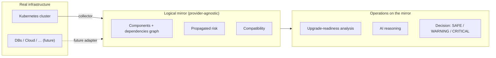
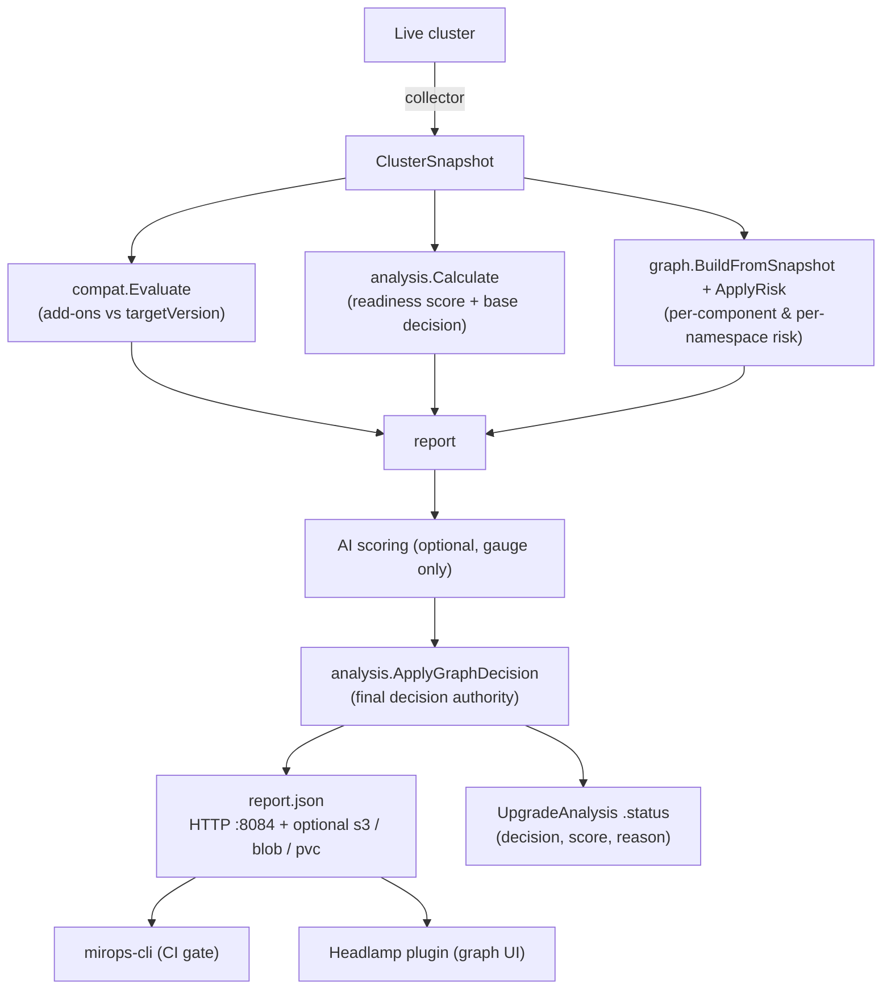

# mirops — Mirror Operations

[](LICENSE)

> **mirops = mirror-operations.** Build a **logical mirror** of your infrastructure, then run
> operations on the mirror instead of the live system: assess risk, reason about dependencies,
> and decide before you act.

**mirops is open source (Apache-2.0).** This repository is the **Kubernetes operator** — the first
implementation of the mirror-operations concept. It builds a logical mirror of a Kubernetes cluster
(a component graph + dependency risk + add-on compatibility) and uses it to evaluate **how ready the
cluster is for a version upgrade**, optionally letting an AI reason over the mirror. The output is a
`report.json` and a decision: `SAFE`, `WARNING`, or `CRITICAL`.

---

## The concept

A *mirror* is a reduced, structured model of real infrastructure; *operations* are the analyses you
run on that model. The idea is provider-agnostic — Kubernetes is the first provider, but the same
mirror could later model databases, cloud resources, or anything with components and dependencies.



The mirror engine (`internal/graph`) is intentionally **infra-agnostic** — only the Kubernetes
*adapter* (`build.go`) knows about k8s. A new provider adds its own adapter; the rest is reused.

---

## What this operator does



- **Logical mirror**: every workload/service/node/PVC/add-on becomes a node; dependencies become
  edges; risk propagates along them — an add-on incompatible with the target version raises the risk
  of everything that depends on it.
- **Condition-driven decision**: the readiness score is a *gauge*; `CRITICAL` comes only from
  **deterministic facts** — an incompatible add-on, a Lost PVC, a blocking PodDisruptionBudget,
  CPU/memory exhaustion, or pods-not-ready beyond a profile threshold. Every reason is listed in
  `decision.blockers`.
- **AI is a copilot, not the pilot**: when enabled it reasons over a digest of the mirror and nudges
  the gauge (`SAFE ↔ WARNING`) — it can never block or unblock; the facts govern the gate.

---

## The mirops ecosystem

The operator produces `report.json`; these open-source tools consume it. Each lives in its own repo.

| Tool | Repo | Role |
|------|------|------|
| **Operator** (this repo) | `miropshq/mirops` | Builds the mirror, scores, decides, serves `report.json`. |
| **CLI** | `miropshq/mirops-cli` | `mirops scan --source … --enforce` — renders the report and **gates a CI/CD pipeline**. |
| **Headlamp plugin** | `miropshq/mirops-ui` | Visualizes the dependency graph, decision, add-on compatibility, and per-namespace risk. |
| **Helm chart** | `miropshq/helm-charts` (`mirops-operator/`) | Deploys the operator + RBAC + reports service. |

---

## Installation

### Prerequisites

- A Kubernetes cluster (see [Compatible versions](#compatible-versions))
- [Helm](https://helm.sh) 3.x and `kubectl`
- *(optional)* An Anthropic or OpenAI API key for AI-assisted scoring

### Install with Helm

The CRDs are **cluster-scoped** and ship as a build artifact (not bundled in the chart). Apply the
CRDs first, then install the chart from the `miropshq/helm-charts` repo:

```sh
# 1. CRDs (cluster-scoped: UpgradeAnalysis, RemediationPlan)
kubectl apply -f config/crd/bases/

# 2. Operator (controller-manager + remediation-manager)
helm install mirops ./mirops-operator --namespace mirops --create-namespace
```

> Images: `ghcr.io/miropshq/mirops/operator` and `ghcr.io/miropshq/mirops/remediation`.
> The chart sets `POD_NAMESPACE` so the operator reads its AI Secret and compatibility-matrix
> ConfigMap from its own namespace (the CRDs are cluster-scoped, so the CR has no namespace).

### AI scoring (optional)

Create a Secret in the operator's namespace and reference it from the CR:

```sh
kubectl create secret generic mirops-ai -n mirops \
  --from-literal=ANTHROPIC_API_KEY=sk-ant-...
```

---

## Usage

`UpgradeAnalysis` is **cluster-scoped** — it analyses the whole cluster, so it has no namespace:

```yaml
apiVersion: mirops.mirops.io/v1
kind: UpgradeAnalysis
metadata:
  name: to-1-34
spec:
  targetVersion: "1.34"
  scoringProfile: production        # or non-production (more lenient)
  scope:
    mode: application               # all | application (exclude system namespaces)
    excludeNamespaces: [monitoring]
  ai:
    enabled: true
    provider: anthropic
    credentialsSecret: mirops-ai    # Secret in the operator namespace
  source:
    type: file                      # file | s3 | blob | pvc (pvc = on-prem persistent storage)
```

```sh
kubectl apply -f analysis.yaml
kubectl get upgradeanalysis to-1-34          # no -n: cluster-scoped
kubectl describe upgradeanalysis to-1-34     # decision, score, reason, blockers
```

Gate a CI/CD pipeline with the CLI:

```sh
mirops scan --source http://<reports-service>:8084/reports/to-1-34.json --enforce
# exits non-zero when decision.allow == false (CRITICAL)
```

---

## Report destinations

The report is always served locally over HTTP (`:8084`). `spec.source.type` adds a destination:

| Type | Purpose | Key fields |
|------|---------|------------|
| `file` | Write to the controller filesystem (default; ephemeral `emptyDir`) | `path` |
| `s3` | Upload to Amazon S3 | `bucket`, `region`, `key`, `credentialsSecret` |
| `blob` | Upload to Azure Blob Storage | `accountName`, `containerName`, `blobName`, `credentialsSecret` |
| `pvc` | Persist to a PersistentVolumeClaim (on-prem, no cloud storage) | `path` (PVC mount dir; report written as `<name>.json`) |

`credentialsSecret` (for s3/blob) is read from the **operator's** namespace. The `pvc` volume is
mounted by the Helm chart (`reportPVC.enabled=true`).

---

## Compatible versions

| Component | Version |
|-----------|---------|
| Built against | Kubernetes `v0.34` libraries (`client-go`/`api` v0.34.1, `controller-runtime` v0.22.4) |
| Runs on | Kubernetes **1.31 – 1.34** (recent clusters; older may work but is untested) |
| Go | 1.24 |
| Add-on compatibility matrix | covers target versions roughly **1.25 – 1.34** |

---

## Add-on compatibility

The compatibility engine (`internal/compat`) ships a built-in matrix and accepts a ConfigMap
override (`mirops-compatibility-matrix` in the operator namespace). It currently recognises six
add-ons: **Istio, cert-manager, Argo CD, ingress-nginx, external-dns, Prometheus**. For an
incompatible add-on it computes the version you'd need to upgrade *to* (inverse lookup).

> The bundled matrix data is illustrative. A community-maintained, vendor-verified `matrix.yaml`
> (editable by PR) is on the roadmap — this section will be updated then.

---

## Development

```sh
go build ./... && go test ./internal/...   # build + unit tests
make manifests                              # regenerate CRDs + RBAC
make lint                                   # golangci-lint (strict)
make run                                    # run against ~/.kube/config
```

See [CLAUDE.md](CLAUDE.md) for architecture, packages, the decision model, conventions, and backlog.

---

## Maintainers

- **Enrique Cruz** — Founder
- **Mario Flores** — Co-founder

## License

Open source under the **Apache License 2.0** (Apache-2.0). See [LICENSE](LICENSE).
